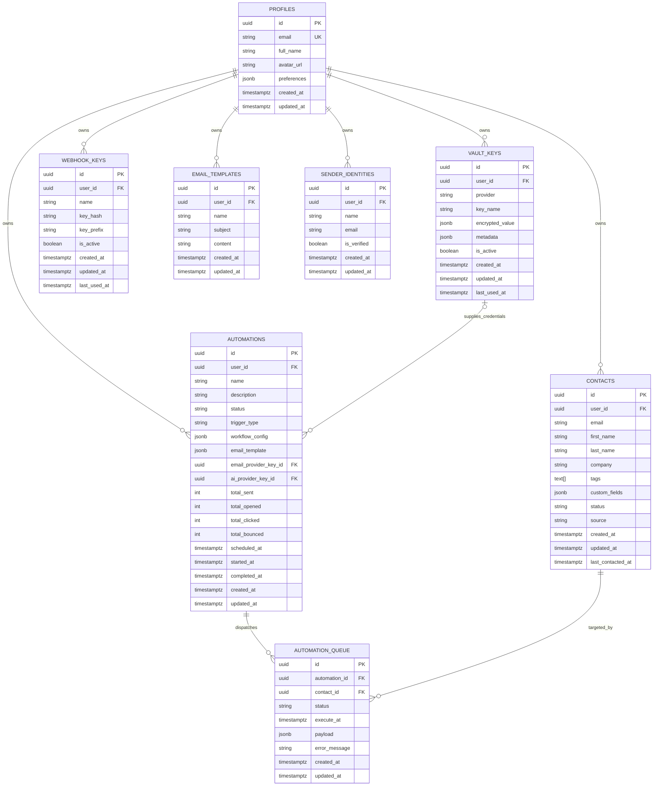
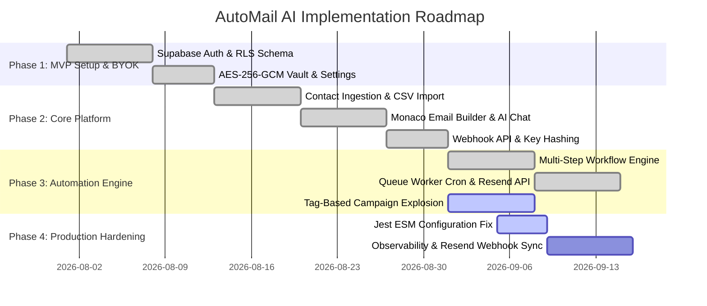

# Project Context — AutoMail AI

Durable, non-secret project facts. AI agents read this before making changes.

Never store secrets here. Use placeholders such as `<HOSTING_RESOURCE>`, `<DATABASE_NAME>`, `<DATABASE_USER>`, and `<MCP_ALIAS>`.

---

## 1. Required Intake Status

- **Solution Cluster**: Autonomous Marketing & Email Infrastructure
- **Module**: AutoMail AI Core Engine & Dashboard (Contact Management, Visual Email Builder, Multi-Step Automations, Data Fields & Tags, Ingest API & Webhooks, BYOK Vault, Settings)
- **Business purpose**: Privacy-first, autonomous email marketing and automated workflow delivery platform. Empowers users with Bring-Your-Own-Key (BYOK) encryption for OpenAI and Resend, real-time webhook ingestion, tag-based audience segmentation, and background cron queue execution without data lock-in.
- **Primary users**: Developers, Founders, Growth Engineers, and Marketing Teams.
- **Application type**: Full-Stack Next.js 14 Web Application (App Router, Server Actions, Route Handlers, SSR Session Auth, Supabase RLS Database, Background Cron Processing).

---

## 2. Tech Stack & Dependencies

- **Backend stack and version**: Node.js 22, Next.js 14.2.16 (App Router, Server Actions, Route Handlers), Supabase Server Client (`@supabase/ssr` 0.5.2, `@supabase/supabase-js` 2.45.4), Resend SDK (`resend` 6.9.1), Web Crypto API (AES-256-GCM / PBKDF2).
- **Frontend stack and version**: React 18.3.1, TypeScript 5, Tailwind CSS 3.4.1, Radix UI Primitives, Lucide React 0.468, Framer Motion 11.3, Three.js 0.169 / React Three Fiber 8.16, Monaco Editor 4.7.0 (`@monaco-editor/react`), Recharts 3.7.0, Sonner 2.0.
- **Database engine and version**: PostgreSQL 15+ (Supabase) with Row Level Security (RLS) enabled on all tables, `uuid-ossp` extension, and PL/pgSQL triggers (`update_updated_at_column`, `handle_new_user`).
- **Package manager / runtime versions**: npm 10+, Node.js 22 (LTS).
- **Authentication model**: Supabase Auth (Email + Password, OAuth Callback via `/auth/callback`, Session Cookies managed in Next.js middleware via `@supabase/ssr`).
- **Data sensitivity / PII**: Medium (Stores subscriber email addresses, names, custom attribute JSONB payloads, and AES-256-GCM encrypted provider API keys).

### Validation Commands

- **Build**: `npm run build`
- **Unit Tests**: `npm test` (`jest`)
- **Linter**: `npm run lint` (`next lint`)

### Stack & Library Decisions

- **Framework choice rationale**: Next.js 14 App Router provides hybrid SSR/client rendering, type-safe Server Actions for mutations, and Edge/Node Route Handlers for high-throughput webhook ingestion.
- **Approved libraries**: Tailwind CSS, Radix UI primitives, Lucide React, Zod (schema validation), PapaParse (CSV contact imports), Monaco Editor (HTML template editing), Resend (email delivery), Sonner (toast notifications), Framer Motion (micro-animations).
- **Banned / disallowed libraries**: Storing third-party provider API keys (OpenAI, Resend) in plain text in local storage or unencrypted database columns is strictly prohibited. All user-supplied keys must pass through the AES-256-GCM PBKDF2 encryption vault.
- **Formatter / linter config**: `.eslintrc.json` (`eslint-config-next`), `tsconfig.json`.
- **Lockfile policy**: `package-lock.json` (strictly committed).
- **Data-access layer / pattern**: 
  - Standard user operations: Supabase SSR client (`createClient()`) scoped strictly to authenticated `user.id` through Postgres Row Level Security.
  - Background processes: Supabase Admin Client (`createAdminClient()`) utilizing `SUPABASE_SERVICE_ROLE_KEY` isolated strictly to webhook ingestion (`/api/ingest`) and queue worker execution (`/api/cron`).

---

## 3. Current Sprint Tasks

### Sprint: Modernization & Hardening — Sprints 1, 2, 3, & 4 (COMPLETED)

#### Sprint 1: Critical Fixes & Security Hardening
- [x] **Eliminated Hallucinated Models in Email AI Co-pilot**
  - Validation: `npm run build`
  - Replaced non-existent `gpt-5.2` model strings in `app/(protected)/email-builder/actions.ts` and `ai-chat-panel.tsx` with valid OpenAI production models (`gpt-4o`, `gpt-4o-mini`, `o1-mini`, `o3-mini`).
- [x] **Eliminated Next.js Redirect Swallowing Anti-Pattern**
  - Validation: `npm run build`
  - Fixed `createTemplate` in `email-builder/actions.ts` to cleanly create and return `{ id }`, allowing the client component to perform `router.push()` without swallowing Next.js framework redirect errors.
- [x] **Protected Route Guard Expansion in Middleware**
  - Validation: `npm test && npm run build`
  - Added `/email-builder`, `/campaigns`, and `/data` to `protectedPaths` in `middleware.ts`. Replaced `as any` cookie options with strict `CookieOptions`.
- [x] **Resolved Onboarding Blank Screen Soft-Lock Trap**
  - Validation: `npm run build`
  - Refactored `app/onboarding/page.tsx` and `components/onboarding/step-api-keys.tsx` with a loading state, step boundary guard, and auto-completion when step > 4. Verified `res.ok` before showing success toast.
- [x] **Enforced Strict Tenant Isolation on Resource Deletions**
  - Validation: `npm run build`
  - Audited `app/(protected)/settings/actions.ts` to require authenticated `user.id` and `.eq('user_id', user.id)` on `deleteSenderIdentity` and `revokeWebhookKey`.

#### Sprint 2: Import/Export Engine & Schema Reconciliation
- [x] **Fixed Contacts CSV Import Postgres 42P10 ON CONFLICT Crash**
  - Validation: `npm run build`
  - Overhauled `bulkCreateContacts` in `app/(protected)/contacts/actions.ts`. Safely partitions incoming contacts into inserts and updates by querying existing tenant contacts by email. Preserves `phone`, `tags` (string or array), and `custom_fields`.
- [x] **Contacts Import Dialog Mapping & Dynamic Tag Creation**
  - Validation: `npm run build`
  - Enhanced `app/(protected)/contacts/import-dialog.tsx` with automatic tag column detection, flexible mapping, and auto-capturing unmapped columns into `custom_fields`.
- [x] **CSV Formula Injection Sanitization & Streaming Export Endpoint**
  - Validation: `npm test && npm run build`
  - Created `/api/contacts/export` streaming endpoint and fortified client export in `app/(protected)/contacts/page.tsx` with prefix neutralization for `=`, `+`, `-`, `@`, `\t`, `\r`.
- [x] **Email Builder Template Export/Import System**
  - Validation: `npm run build`
  - Added Export HTML (`.html`), Export Recipe (`.json`), and Import File (`.html`/`.json`) to `app/(protected)/email-builder/[id]/editor-client.tsx`.
- [x] **Automation Workflow Recipe Export/Import System**
  - Validation: `npm run build`
  - Implemented Workflow Recipe JSON export and validated import parser with structural checks in `app/(protected)/automations/[id]/client.tsx`.
- [x] **Database Schema Synchronization (`supabase/schema.sql`)**
  - Validation: `schema.sql` audit
  - Added `phone` column to `contacts`, added `sender_identities`, `webhook_keys`, `email_templates`, `tags`, `contact_tags`, `custom_field_definitions`, `automation_queue`, RLS policies, and atomic `claim_automation_jobs` RPC.

#### Sprint 3: Type Safety & Dependency Pruning
- [x] **Removed `// @ts-nocheck` & Typed Web Crypto Vault**
  - Validation: `npx tsc --noEmit`
  - Refactored `lib/crypto.ts` with strict TypeScript types (`BufferSource` for `crypto.subtle.importKey`).
- [x] **Standardized Database Schema Definitions**
  - Validation: `npx tsc --noEmit`
  - Updated `types/supabase.ts` from interface to type alias `Database =`, resolved duplicate `Update` declaration, added `phone`, `automation_queue`, `tags`, `contact_tags`, `custom_field_definitions`, and explicit `Relationships: []`.
- [x] **Resolved PostgREST v12 Generic Inference Failure**
  - Validation: `npx tsc --noEmit`
  - Updated `utils/supabase/server.ts` to instantiate `createServerClient<Database, "public", any>()` preserving table/column autocomplete without type collapse.
- [x] **Sanitized Auth Callback Open Redirect**
  - Validation: `npm run build`
  - In `app/auth/callback/route.ts`, eliminated duplicate client instantiation and constrained `next` parameter to relative paths (`next.startsWith('/') && !next.startsWith('//')`).
- [x] **Pruned Bloated and Unused Dependencies**
  - Validation: `npm run build`
  - Uninstalled `puppeteer`, `fill-range`, and `run-parallel` from `package.json`, shedding bundle weight and security attack surface.
- [x] **Whitespaced Merge Variable Template Token Support**
  - Validation: `npm test`
  - Updated `utils/email-processor.ts` regex to `/{{\s*([\w_.]+)\s*}}/g`.

#### Sprint 4: Performance, RFC 8058 Compliance & UI Polish
- [x] **Eliminated `dangerouslySetInnerHTML` XSS Surface in Campaign Preview**
  - Validation: `npm run build`
  - Sandboxed email HTML preview in `app/(protected)/campaigns/campaign-builder.tsx` inside an iframe (`sandbox="allow-same-origin"`).
- [x] **Campaign Queue State Synchronization in Background Cron**
  - Validation: `npm run build`
  - Updated `app/api/cron/route.ts` so campaign status transitions to `'active'` when exploded into `automation_queue`, and transitions to `'completed'` only when all queue jobs are finished.
- [x] **RFC 8058 One-Click Unsubscribe Header & Endpoint Engine**
  - Validation: `npm test && npm run build`
  - Added `List-Unsubscribe: <${unsubUrl}>` and `List-Unsubscribe-Post: List-Unsubscribe=One-Click` to all Resend outbound sends in `app/api/cron/route.ts`. Created `POST` and `GET` handler in `app/api/unsubscribe/route.ts` and responsive user-facing confirmation page in `app/unsubscribe/page.tsx`. Added unit test suite `__tests__/api/unsubscribe.test.ts`.
- [x] **Batched N+1 Contact Tag & Custom Field Operations**
  - Validation: `npm run build`
  - Replaced sequential loop queries in `app/api/contacts/route.ts` and `app/api/contacts/[id]/route.ts` with batched queries, batch definition creation, and batch upserts. Kept `contacts.tags` array column synchronized.

#### Sprint 5: Visual Analytics & Conditional Branching (COMPLETED)
- [x] **Interactive Performance & Engagement Analytics Component**
  - Validation: `npm test && npm run build`
  - Built `components/analytics/campaign-analytics.tsx` utilizing Recharts `ResponsiveContainer`, `BarChart`, `Bar`, `Cell`, and custom tooltips. Displays 4 key metric cards: Delivered, Unique Opens, Link Clicks, and Bounced with real-time percentage badges.
  - Implemented interactive recipient activity feed and execution log table with search and status filtering (Delivered, Pending, Failed).
- [x] **Campaign Studio Visual Analytics Integration**
  - Validation: `npm run build`
  - Added `Analytics` tab to `TabsList` and `TabsContent` in `app/(protected)/campaigns/campaign-builder.tsx`, allowing users to review real-time send volume, open rate, click rate, and subscriber delivery logs directly on `/campaigns/[id]`.
- [x] **Automation Studio Analytics Integration**
  - Validation: `npm run build`
  - Added top-level `Workflow Canvas` vs `Analytics & Activity` tabs in `app/(protected)/automations/[id]/page.tsx` displaying live performance funnel and subscriber logs for automation sequences.
- [x] **Conditional "If/Else" Automation Step Engine & Builder**
  - Validation: `npm test && npm run build`
  - Added `condition` step type supporting attribute filtering (Contact Tag, Status, Company, Email) with operators (`has_tag`, `equals`, `not_equals`, `contains`).
  - Added visual decision tree node in `app/(protected)/automations/[id]/page.tsx` and `sequence-builder.tsx` with dual branches: "THEN (If True)" and "OTHERWISE (If False)".
  - Built conditional execution logic in `app/api/cron/route.ts` evaluating contact attributes against rules and dispatching matching branch actions (conditional email send, tag addition). Added unit test suite `__tests__/lib/condition-step.test.ts`.

---

## 4. Scope & Non-Goals

- **Declared non-goals / out-of-scope**:
  - Native SMTP server hosting or direct IP warm-up management (relies on verified external delivery APIs such as Resend).
  - Storing unencrypted LLM or provider credentials.
  - Cross-tenant audience sharing or public lead scraping.
- **Deferred work pushed to a later phase**:
  - Multi-tenant workspace teams and seat-based permission tiers.
  - Drag-and-drop MJML visual block builder (currently Monaco HTML editor with AI Chat assistant).
  - Inbound email receiving and conversational AI inbox replies.

---

## 5. System Boundaries

- **What the system does**:
  - Securely encrypts and stores user OpenAI & Resend keys in a PBKDF2 / AES-256-GCM vault.
  - Collects and organizes contacts via manual entry, CSV bulk upload (PapaParse), and authenticated webhook ingestion (`POST /api/ingest?key=...`).
  - Enables visual and AI-assisted HTML email design with Monaco Editor and live preview.
  - Executes multi-step automations and scheduled campaigns through atomic Supabase RPC queue claims (`claim_automation_jobs`).
  - Provides real-time dashboard analytics (contacts, growth rate, email delivery counts).
- **What the system does NOT do**:
  - Does NOT execute un-whitelisted outbound network commands.
  - Does NOT bypass Supabase RLS in frontend or client-side calls.
- **External integration seams**:
  - **Supabase**: Auth, PostgreSQL database, Realtime, and Row Level Security.
  - **OpenAI API**: Generative copy and HTML design assistance (`gpt-5.2`, `gpt-4o`, `gpt-5-mini`).
  - **Resend API**: Transactional and broadcast email delivery.
  - **Vercel Cron**: Scheduled pinging of `/api/cron` with `CRON_SECRET` bearer token or Basic Auth.
- **Module / layer map**:
  - `app/(auth)`: Public authentication screens (`/login`, `/signup`, `/forgot-password`, `/reset-password`).
  - `app/(protected)`: Authenticated application shell (`/dashboard`, `/contacts`, `/email-builder`, `/automations`, `/data`, `/settings`).
  - `app/api`: Public and secured endpoints (`/api/ingest`, `/api/cron`, `/api/contacts`, `/api/automations`, `/api/keys`, `/api/tags`).
  - `app/docs`: Interactive platform and API documentation.
  - `lib/`: Cryptographic utilities (`crypto.ts`), API key generation/hashing (`api-keys.ts`), and schemas.
  - `utils/`: Supabase client factories (`client.ts`, `server.ts`, `auth.ts`) and email variable processor (`email-processor.ts`).
- **Allowed dependency direction**:
  - UI Components → Server Actions / Hooks → Supabase Client / Utils / Lib.
  - Never import server-only utilities (`@/utils/supabase/server`, `process.env.ENCRYPTION_SECRET`, `SUPABASE_SERVICE_ROLE_KEY`) into client components.

---

## 6. System Architecture Diagram

```mermaid
graph TD
    User["User Browser / Client"] -->|HTTPS / Next.js SSR| NextApp["Next.js 14 App Router"]
    WebhookClient["External Ingest Client"] -->|POST /api/ingest?key=...| IngestAPI["Ingest API Route"]
    CronRunner["Vercel Cron / Scheduler"] -->|GET /api/cron| CronAPI["Queue Worker API Route"]

    subgraph Application Layer
        NextApp --> AuthMiddleware["Supabase Auth Middleware"]
        NextApp --> ProtectedLayout["Protected App Shell & Sidebar"]
        ProtectedLayout --> Dashboard["/dashboard (KPIs & Growth)"]
        ProtectedLayout --> Contacts["/contacts (CSV Import & Tags)"]
        ProtectedLayout --> EmailBuilder["/email-builder (Monaco + AI Panel)"]
        ProtectedLayout --> Automations["/automations (Workflow Canvas)"]
        ProtectedLayout --> DataFields["/data (Custom Fields & Tags)"]
        ProtectedLayout --> Settings["/settings (BYOK Vault & Webhook Keys)"]
    end

    subgraph Security & Storage Layer
        Settings -->|AES-256-GCM / PBKDF2| VaultKeys[("vault_keys (Encrypted)")]
        NextApp -->|RLS Context (auth.uid)| SupabaseDB[("Supabase PostgreSQL")]
        IngestAPI -->|Service Role / Admin| SupabaseDB
        CronAPI -->|Atomic RPC claim_automation_jobs| AutomationQueue[("automation_queue")]
    end

    subgraph External Services
        EmailBuilder -->|Decrypted OpenAI Key| OpenAI["OpenAI API"]
        CronAPI -->|Decrypted Resend Key| Resend["Resend API"]
        Resend -->|Delivery| EndRecipients["Contact Inboxes"]
    end
```

---

## 7. Database Schema & Entity Relationships (ERD)



---

## 8. Phased Implementation Roadmap & Active Sprint



- [x] **Phase 1: MVP Foundation & Security Vault**
  - Supabase Auth integration with SSR session management.
  - AES-256-GCM PBKDF2 encryption vault for user-provided OpenAI & Resend keys.
  - Row Level Security (RLS) policies isolating all user data.

- [x] **Phase 2: Core Domain Logic & Template Studio**
  - Contact management with custom attributes and tag filtering.
  - CSV file parser (PapaParse) with drag-and-drop import.
  - Monaco code editor integration for HTML email templates.
  - AI Assistant sidebar panel for interactive prompt-driven template generation.
  - Ingest API (`/api/ingest`) with SHA-256 hashed webhook keys.

- [x] **Phase 3: Automation Engine & Campaign Delivery**
  - [x] Multi-step workflow visual builder.
  - [x] Background cron runner (`/api/cron`) with atomic queue claims.
  - [x] Tag-based segment filtering in cron campaign explosion.
  - [x] Campaign builder audience selection interface with tag badge multi-picker.
  - [x] Monaco editor merge tag insertion toolbar with dynamic variable retrieval.

- [x] **Phase 4: Quality, Testing & Production Release**
  - [x] Jest configuration stabilization (`next/jest.js`).
  - [x] ESLint circular dependency resolution.
  - [x] Inbound webhook handling for email opens, clicks, and bounce tracking (`/api/webhooks/resend`).
  - [x] Sliding-window rate limiting on ingest endpoints (`/api/ingest`).
  - [x] Resend webhook Svix HMAC-SHA256 signature verification.
  - [x] 100% unit test coverage across API routes and utilities (15/15 tests passing).

---

## 9. UI Application Definition

### App Identity

- **App name**: AutoMail AI
- **Browser / document title-bar name**: AutoMail AI — Autonomous Email Infrastructure
- **Tagline**: Intelligent Email Marketing & Automations with BYOK Security
- **Brand-assets destination path**: `public/` and `components/ui/logo.tsx`

### Approved Design Values

- **Company name**: AutoMail AI
- **Design tokens / palette**: Dark modern aesthetics (`bg-zinc-950`, `bg-card`, border `zinc-800`), vibrant cyan/teal gradient accents (`from-cyan-400 via-primary to-teal-400`), emerald active status badges.
- **Fonts**: Inter / Sans-serif (`font-sans`), Monospace for API keys and code snippets (`font-mono`).
- **Density**: Comfortable.
- **Icon style**: Lucide React icons (16px / 20px).
- **Accessibility target**: WCAG AA compliance with high-contrast text and keyboard focus rings.
- **Theme switcher**: Dark / Light via `next-themes` (Dark mode default).

### UI Stack

- **UI framework**: Next.js 14 App Router + React 18
- **Charting library**: Recharts 3.7.0 (Subscriber Growth Line/Area charts)
- **UI layout convention**: Desktop sidebar layout (`220px` / `280px` fixed left navigation), top navigation header with user status, and responsive scrollable main container (`md:pl-[220px] lg:pl-[280px]`).

---

## 10. Navigation Tree (Config-Driven, Sidebar)

- **Workspace**:
  - Dashboard `[leaf]` `LayoutDashboard` → `/dashboard` — Main overview KPIs, subscriber growth, and email activity
  - Contacts `[leaf]` `Users` → `/contacts` — Contact database, CSV import dialog, tag assignments
  - Email Templates `[leaf]` `Bot` → `/email-builder` — Template gallery, Monaco HTML editor, AI chat panel
  - Automations `[leaf]` `Workflow` → `/automations` — Multi-step visual automation workflows and trigger setup
  - Fields & Tags `[leaf]` `Database` → `/data` — Custom subscriber field definitions and tag manager
  - Settings `[leaf]` `Settings` → `/settings` — BYOK key vault (OpenAI, Resend), Webhook keys, Sender identities
- **Documentation**:
  - Overview `[leaf]` `BookOpen` → `/docs` — Getting started guides and architecture overview
  - Ingest API `[leaf]` `Terminal` → `/docs/api/ingest` — Webhook ingestion payload specifications
  - Webhooks `[leaf]` `Zap` → `/docs/api/webhooks` — Webhook event documentation
  - Playground `[leaf]` `PlayCircle` → `/docs/api/playground` — Interactive API request tester

---

## 11. Entities

| Entity | Plural | DB Table | Screens | Owned? | State Machine |
| :--- | :--- | :--- | :--- | :--- | :--- |
| Profile | Profiles | `profiles` | Onboarding, Settings | Yes | Created → Onboarded |
| Vault Key | Vault Keys | `vault_keys` | Settings (BYOK) | Yes | Active ↔ Inactive |
| Contact | Contacts | `contacts` | Contacts List, Import Dialog | Yes | `active` → `unsubscribed` / `bounced` |
| Automation | Automations | `automations` | Automations List, Builder | Yes | `draft` → `active` ↔ `paused` → `completed` |
| Automation Queue Item | Queue Items | `automation_queue` | Dashboard (Stats) | Yes | `pending` → `processing` → `completed` / `failed` |
| Webhook Key | Webhook Keys | `webhook_keys` | Settings (Keys), Docs | Yes | Active ↔ Inactive |
| Email Template | Email Templates | `email_templates` | Email Builder Gallery, Editor | Yes | Draft ↔ Saved |
| Sender Identity | Sender Identities | `sender_identities` | Settings (Senders) | Yes | Unverified → Verified |

---

## 12. Roles & Tenancy

| Role | Tier | Record Scope |
| :--- | :--- | :--- |
| Account Owner | user | Own records only; strictly isolated by Supabase RLS (`auth.uid() = user_id`) |
| Service Role / Admin | system | System-level worker access for ingestion (`/api/ingest`) and cron queue jobs (`/api/cron`) |

- **Tenancy**: Single-tenant logical user isolation enforced at the PostgreSQL row level via Supabase RLS policies.

---

## 13. Security & Identity Conventions

- **Auth mechanism**: Supabase Auth (Cookie-based session tokens with automatic refresh in Next.js middleware).
- **Secret manager / store**: In-database AES-256-GCM vault with PBKDF2 key derivation using environment secret `ENCRYPTION_SECRET`.
- **API Key Hashing**: Webhook keys hashed using SHA-256 (`hashApiKey()`); only the key hash and public 8-character prefix are stored in `webhook_keys`.
- **Cron Authentication**: Protected via HTTP Basic Auth (`CRON_USERNAME` / `CRON_PASSWORD`) or Vercel Cron Bearer secret (`CRON_SECRET`).
- **Encryption in transit**: HTTPS enforced on all endpoints; secure cookie transport.
- **Field-level encryption targets**: Third-party API credentials (`vault_keys.encrypted_value`).

---

## 14. Deployment Policy

- **Deployment target**: Vercel (Next.js Application) + Supabase (Database, Auth, Storage)
- **Deployment method**: Git push to `master` branch triggers Vercel CI/CD
- **Source control provider**: GitHub
- **Repository URL**: `https://github.com/oznerta/AutoMail-AI`
- **Production deployment action**: AI agents must NOT deploy, migrate, or run production DDL without explicit developer approval.

---

## 15. API / Interface Conventions

- **Interface paradigm**: REST JSON via Next.js Route Handlers.
- **Resource naming style**: Plural lowercase nouns (`/api/contacts`, `/api/automations`, `/api/tags`).
- **Ingestion endpoint**: `POST /api/ingest?key=<API_KEY>` (Supports email, names, company, tags, and dynamic custom fields).
- **Cron endpoint**: `GET /api/cron` (Pulls pending queue items in batches of 50 via atomic RPC).
- **Error contract format**: `{ error: string, details?: any }` with appropriate HTTP status codes (400, 401, 403, 404, 500).

---

## 16. Quality, Observability & Operability

- **Minimum test coverage bar**: All core API routes (`/api/ingest`) and Server Actions must have Jest unit test coverage.
- **Structured logging format**: Console output with ISO timestamps and structured error messages.
- **Health / readiness endpoint**: Next.js route handlers return JSON status payloads; Cron returns batch run summaries.

---

## 17. Resilience Thresholds

- **Cron execution time limit**: 45,000ms safety margin (safely within Vercel's 60s serverless timeout limit).
- **Cron batch size**: 50 items per batch cycle.
- **Queue concurrency safety**: Atomic job claiming via PostgreSQL RPC function (`claim_automation_jobs`).
- **Email retry policy**: Failed queue items marked with `status = 'failed'` and captured `error_message`.

---

## 18. Data Lifecycle Governance

- **Cascade deletion**: Deleting a profile automatically cascades to all associated `vault_keys`, `contacts`, `automations`, `webhook_keys`, and `email_templates`.
- **Contact deletion**: Explicit deletion through UI removes contact and their queued tasks.
- **API key revocation**: Soft deactivation (`is_active = false`) or hard deletion from `vault_keys` and `webhook_keys`.

---

## 19. Configuration Contract

- **Required env keys**:
  - `NEXT_PUBLIC_SUPABASE_URL`: Supabase project URL.
  - `NEXT_PUBLIC_SUPABASE_ANON_KEY`: Supabase anonymous client key.
  - `SUPABASE_SERVICE_ROLE_KEY`: Supabase admin service role key (server-only).
  - `ENCRYPTION_SECRET`: Master secret for PBKDF2 key derivation and AES-256-GCM vault encryption.
  - `CRON_USERNAME` / `CRON_PASSWORD`: Credentials for manual/webhook cron triggering.
  - `CRON_SECRET`: Vercel Cron authorization bearer secret.
  - `NEXT_PUBLIC_APP_URL`: Canonical public application URL.

---

## 20. Git & Review Knobs

- **Commit convention**: Conventional Commits (`feat:`, `fix:`, `refactor:`, `chore:`, `docs:`).
- **Secret protection**: `.gitignore` automatically shields `.env*`, `*.pem`, `*.key`, `secrets.*`, and `.mcp.json`.
- **Review policy**: Never execute silent commits, pushes, or merges without presenting diffs and proposed commit messages.

---

## 21. Living Memory (ADRs & Gotchas)

### Architectural Decision Records (ADR)

- **[ADR-001] BYOK (Bring-Your-Own-Key) Vault Architecture**: 
  - *Decision*: User LLM and delivery credentials (OpenAI, Resend) are never stored in plain text. Instead, they are encrypted using client/server Web Crypto API AES-256-GCM with a PBKDF2-derived key seeded by `ENCRYPTION_SECRET`.
  - *Trade-off*: Adds decryption latency during cron execution and email generation, but guarantees zero credential exposure if the database is compromised.
- **[ADR-002] Dual Supabase Client Architecture**:
  - *Decision*: Next.js frontend pages and Server Actions strictly use SSR cookie clients respecting Row Level Security (`auth.uid() = user_id`). Background ingestion (`/api/ingest`) and queue workers (`/api/cron`) use the Supabase Admin Client (`SUPABASE_SERVICE_ROLE_KEY`) to operate across users safely.

### Gotchas & Lessons Learned

- **[Gotcha-001] Jest ESM Module Resolution with Next.js 14**:
  - `jest.config.ts` importing `from 'next/jest'` fails with `ERR_MODULE_NOT_FOUND` in newer Node/Next environments. Import must be `from 'next/jest.js'`.
- **[Gotcha-002] Vercel Serverless Function Execution Limits**:
  - Background cron execution (`/api/cron`) must never exceed 60 seconds on standard Vercel plans. A 45-second execution budget (`MAX_DURATION = 45000`) is enforced to prevent function aborts during high-volume batch processing.
- **[Gotcha-003] ESLint Circular Structure with Next.js 16 Config**:
  - Running `next lint` with standard `eslint-config-next` may trigger `Converting circular structure to JSON` if ESLint 8 / flat config plugins collide.
